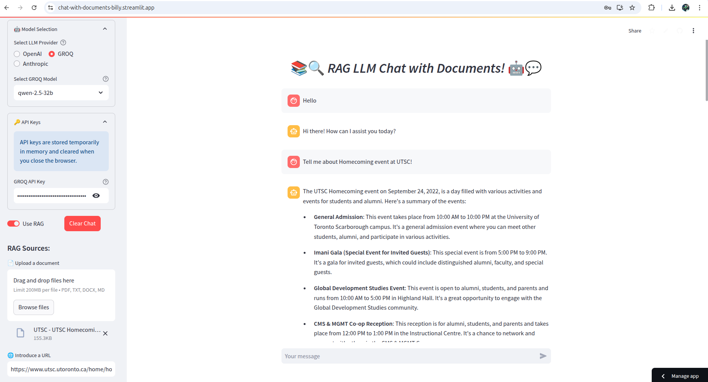

# 📚 Chat With Documents

A **Retrieval-Augmented Generation (RAG)** application that lets users chat with their own documents and web content using Large Language Models.

Built with **Python, Streamlit, LangChain, Hugging Face embeddings, and ChromaDB**, the application retrieves relevant information from uploaded sources and uses it as context when generating responses.



---

## 🚀 Features

- 📄 Upload **PDF, DOCX, TXT, and Markdown** documents
- 🌐 Load and query content from **URLs**
- 🔎 Semantic document retrieval using vector embeddings
- 🧠 **Retrieval-Augmented Generation (RAG)**
- 💬 History-aware conversational retrieval
- 🤖 Support for **OpenAI, Groq, and Anthropic** LLM providers
- ⚡ Streaming AI responses
- 💾 ChromaDB vector storage
- 🧩 Local Hugging Face embeddings
- 🔄 RAG can be enabled or disabled from the interface
- 🚫 Prevents duplicate sources within the active session
- 🧹 Filters empty document chunks before embedding
- 🔐 API keys are supplied at runtime rather than stored in the repository

---

## 🧠 How It Works

```text
Document / URL
      ↓
Content Loading
      ↓
Text Chunking
      ↓
Hugging Face Embeddings
      ↓
Chroma Vector Database
      ↓
Semantic Retrieval
      ↓
Relevant Context + User Question
      ↓
LLM
      ↓
Context-Aware Response
```

The application uses the **`all-mpnet-base-v2`** embedding model to convert document chunks into vector representations.

When a question is asked, Chroma retrieves semantically relevant chunks and passes them to the selected LLM as additional context.

This allows responses to be grounded in the user's documents instead of relying entirely on the model's pre-trained knowledge.

---

## 🛠️ Tech Stack

| Technology | Purpose |
|---|---|
| Python | Core application |
| Streamlit | Web interface |
| LangChain | RAG and LLM orchestration |
| ChromaDB | Vector database |
| Hugging Face | Local text embeddings |
| OpenAI | LLM provider |
| Groq | LLM provider |
| Anthropic | LLM provider |

---

## 📂 Project Structure

```text
chat-with-documents/
│
├── streamlit_app.py      # Streamlit UI and application flow
├── rag_utils.py          # Loading, chunking, embeddings and retrieval
├── requirements.txt      # Python dependencies
├── app.png               # Application screenshot
├── .gitignore
└── README.md
```

The application may also create runtime directories such as:

```text
source_files/             # Temporary uploaded files
chroma_db_*/              # Local Chroma vector stores
```

These are generated application data and are excluded from Git.

---

## ⚙️ Setup

### 1. Clone the repository

```bash
git clone https://github.com/gtmsandy/chat-with-documents.git
cd chat-with-documents
```

### 2. Create a virtual environment

**Python 3.11 is recommended.**

```bash
python -m venv .venv
```

Activate it on Windows:

```powershell
.\.venv\Scripts\Activate.ps1
```

Linux/macOS:

```bash
source .venv/bin/activate
```

### 3. Install dependencies

```bash
pip install -r requirements.txt
```

### 4. Run the application

```bash
streamlit run streamlit_app.py
```

Streamlit will normally start the application at:

```text
http://localhost:8501
```

---

## 🔑 LLM Configuration

Select an LLM provider from the application sidebar:

- **OpenAI**
- **Groq**
- **Anthropic**

Provide the API key for the selected provider through the application.

Then upload documents or provide a URL and initialize the knowledge base.

---

## 💬 Example Usage

Upload a document and ask questions such as:

```text
Summarize this document.

What are the main conclusions?

Explain this section in simpler terms.

What does the document say about this topic?

Compare the important points mentioned in the uploaded sources.
```

With RAG enabled, the application retrieves relevant document content before generating its response.

---

## 🔄 RAG vs Standard Chat

### RAG Enabled

```text
Question → Retrieve Relevant Chunks → Add Context → LLM → Answer
```

Best when asking questions about uploaded documents.

### RAG Disabled

```text
Question → LLM → Answer
```

Works as a regular LLM conversation without document retrieval.

---

## ✅ Current Status

The core RAG workflow is functional:

- Document loading
- URL ingestion
- Text chunking
- Local embedding generation
- Chroma indexing
- Semantic retrieval
- Conversational retrieval
- Multiple LLM providers
- Streaming responses
- Temporary file cleanup
- Duplicate-source protection
- Empty-chunk validation

The application has also been tested with real document ingestion and retrieval queries.

---

## 🗺️ Planned Improvements

The next improvements are focused on making the project more reliable and production-ready:

- 📌 Source citations and document attribution in answers
- 🧪 Automated unit and integration tests
- 🔍 Improved retrieval evaluation
- 🗂️ Better Chroma database lifecycle and cleanup
- 🔐 Stronger URL validation and input security
- 📊 Application logging and error monitoring
- 📦 Cleaner and more tightly managed dependencies
- 🎯 Improved model and retrieval configuration

---

## 👨‍💻 Author

**Sandeep Harijan**

Final-year Computer Science & Engineering student interested in **Software Engineering, Generative AI, Retrieval-Augmented Generation, and Full-Stack Development**.

GitHub: [@gtmsandy](https://github.com/gtmsandy)

---

⭐ If you find the project useful, consider starring the repository.
